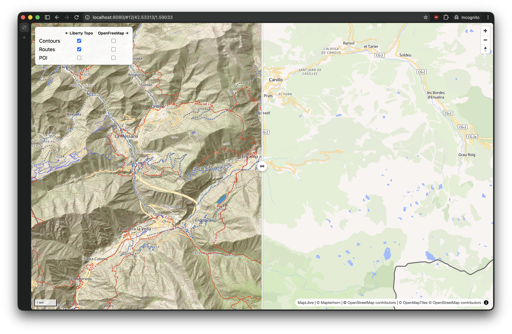

# Outdoor style



Builds three OpenStreetMap-based MBTiles:

- `output/openmaptiles.mbtiles` - OpenMapTiles basemap; paths, tracks, service, minor, and tertiary roads start at zoom 11
- `output/routes.mbtiles` - hiking, foot, and bicycle route relations, similar to [Waymarked Trails](https://waymarkedtrails.org/)
- `output/poi.mbtiles` - selected outdoor POIs

Route generation also creates sprite:

- `output/routes-sprite.png` and `output/routes-sprite.json`
- `output/routes-sprite@2x.png` and `output/routes-sprite@2x.json`

## Highlights

- Adds [maplibre-contour](https://github.com/onthegomap/maplibre-contour)
- Based on [gpxstudio's Liberty Topo](https://github.com/gpxstudio/styles/blob/main/liberty-topo.json)
- Custom colors for bicycle routes and restricted areas
- Removes basemap POIs and provides selected POIs as a separate overlay
- Shows hiking routes
- Shows paths from zoom 11

## Usage

Install [Docker](https://docs.docker.com/get-docker/), then run:

```sh
./tiles.sh generate --country europe/monaco
```

Country values are [Geofabrik](https://download.geofabrik.de/) extract paths.
Repeat `--country` to combine extracts. To generate one target:

```sh
./tiles.sh generate routes --country europe/monaco
```

## Licenses

The code is MIT-licensed.

`profiles/openmaptiles/Transportation.java` is derived from planetiler-openmaptiles
and uses its BSD 3-Clause license.

`tools/waymarked-sprite` is GPL-3.0 and uses `waymarkedtrails-shields` under
the same license.

Run `./tiles.sh` to list all commands.

## Demo

```sh
./tiles.sh demo
```

Open [http://localhost:8080](http://localhost:8080).
